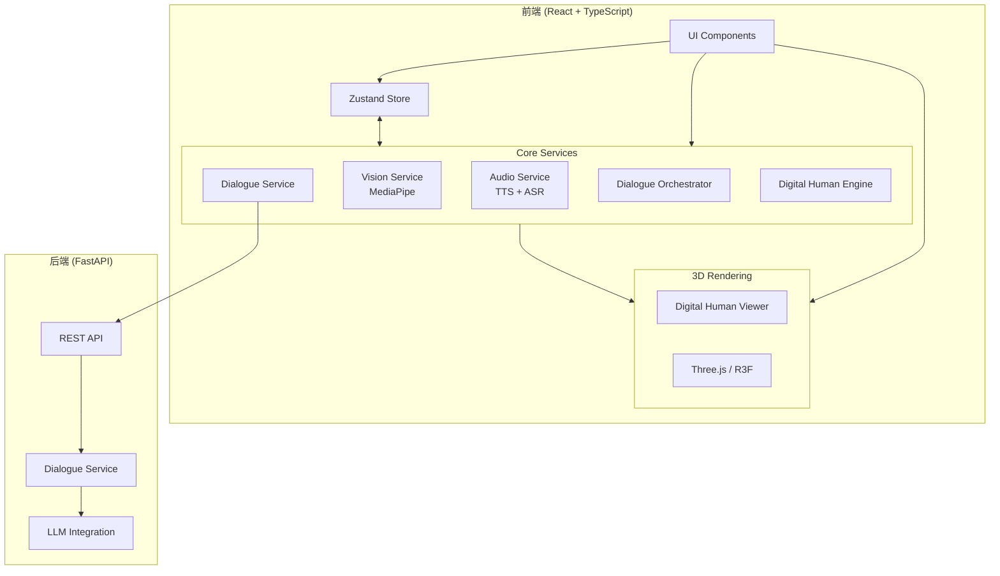
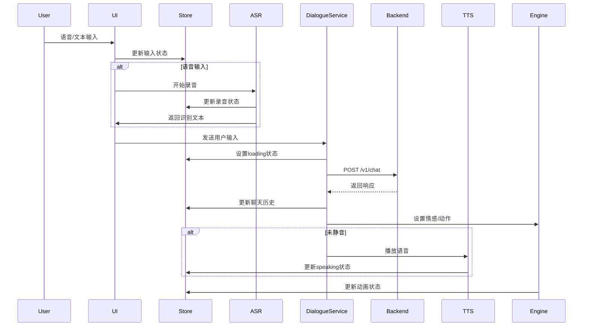
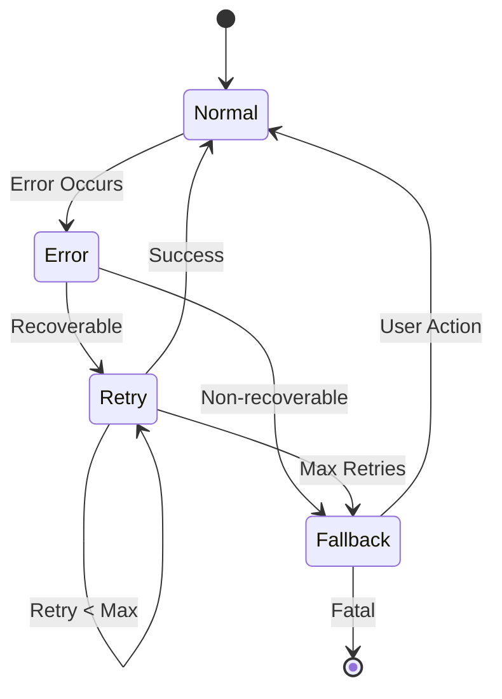

# Design Document: Digital Human Platform Refactor

## Overview

本设计文档描述了数字人交互平台重构的技术架构和实现方案。重构目标是提升系统的健壮性、可靠性和用户体验，同时保持现有功能的兼容性。

重构采用渐进式改进策略，优先修复核心服务层的问题，然后逐步完善UI层和性能优化。

## Architecture

### 系统架构图



### 数据流图



## Components and Interfaces

### 1. Audio Service (重构)

```typescript
// src/core/audio/audioService.ts

interface SpeechQueueItem {
  text: string;
  config: TTSConfig;
  resolve: () => void;
  reject: (error: Error) => void;
}

export class TTSService {
  private synth: SpeechSynthesis;
  private voices: SpeechSynthesisVoice[];
  private config: TTSConfig;
  private isInitialized: boolean;
  private speechQueue: SpeechQueueItem[];
  private isProcessingQueue: boolean;
  
  // 新增：语音队列管理
  async speak(text: string, config?: Partial<TTSConfig>): Promise<void>;
  
  // 新增：队列处理
  private processQueue(): Promise<void>;
  
  // 新增：清空队列
  clearQueue(): void;
  
  // 新增：获取队列长度
  getQueueLength(): number;
  
  // 现有方法保持兼容
  stop(): void;
  pause(): void;
  resume(): void;
  isSupported(): boolean;
  isSpeaking(): boolean;
  getVoices(): SpeechSynthesisVoice[];
  updateConfig(config: Partial<TTSConfig>): void;
}

export interface ASRConfig {
  lang?: string;
  continuous?: boolean;
  interimResults?: boolean;
  maxAlternatives?: number;
  timeout?: number;  // 新增：超时配置
}

export class ASRService {
  private recognition: SpeechRecognition | null;
  private isSupported: boolean;
  private callbacks: ASRCallbacks;
  private config: ASRConfig;
  private timeoutId: ReturnType<typeof setTimeout> | null;
  
  // 新增：权限检查
  async checkPermission(): Promise<PermissionState>;
  
  // 新增：请求权限
  async requestPermission(): Promise<boolean>;
  
  // 改进：支持超时
  start(options?: ASRStartOptions): Promise<boolean>;
  
  // 改进：确保资源释放
  stop(): void;
  
  // 新增：中断并清理
  abort(): void;
  
  // 现有方法
  checkSupport(): boolean;
  setCallbacks(callbacks: ASRCallbacks): void;
}
```

### 2. Vision Service (重构)

```typescript
// src/core/vision/visionService.ts

export interface VisionServiceConfig {
  maxRetries: number;
  retryDelay: number;
  emotionDebounceMs: number;
  motionCooldownMs: number;
  targetFps: number;
}

export class VisionService {
  private video: HTMLVideoElement | null;
  private stream: MediaStream | null;
  private running: boolean;
  private status: VisionStatus;
  private faceMesh: FaceMesh | null;
  private pose: Pose | null;
  private config: VisionServiceConfig;
  private lastEmotionTime: number;
  private lastMotionTime: number;
  private retryCount: number;
  
  // 新增：配置更新
  updateConfig(config: Partial<VisionServiceConfig>): void;
  
  // 改进：带重试的模型加载
  private async loadModelsWithRetry(): Promise<boolean>;
  
  // 新增：情绪防抖
  private debounceEmotion(emotion: UserEmotion): UserEmotion | null;
  
  // 新增：动作冷却
  private shouldEmitMotion(motion: string): boolean;
  
  // 改进：更好的错误处理
  async start(
    videoElement: HTMLVideoElement,
    onEmotion: EmotionCallback,
    onMotion?: MotionCallback
  ): Promise<boolean>;
  
  // 改进：确保资源释放
  stop(): void;
  
  // 现有方法
  getStatus(): VisionStatus;
  getFps(): number;
  isRunning(): boolean;
  checkCameraPermission(): Promise<boolean>;
}
```

### 3. Dialogue Service (重构)

```typescript
// src/core/dialogue/dialogueService.ts

export interface DialogueServiceConfig {
  maxRetries: number;
  retryDelay: number;
  timeout: number;
  maxHistoryLength: number;
}

export interface RetryState {
  attempt: number;
  lastError: Error | null;
  nextRetryTime: number;
}

// 改进：更健壮的发送函数
export async function sendUserInput(
  payload: ChatRequestPayload,
  config?: Partial<DialogueServiceConfig>
): Promise<ChatResponsePayload>;

// 新增：响应验证
function validateResponse(data: unknown): ChatResponsePayload;

// 新增：智能降级响应
function getFallbackResponse(
  userText: string,
  context?: { emotion?: string; lastTopic?: string }
): ChatResponsePayload;

// 改进：连接状态检查
export async function checkServerHealth(): Promise<{
  healthy: boolean;
  latency: number;
  services: Record<string, string>;
}>;

// 新增：会话管理
export function clearSession(sessionId: string): void;
export function getSessionHistory(sessionId: string): ChatMessage[];
```

### 4. Dialogue Orchestrator (重构)

```typescript
// src/core/dialogue/dialogueOrchestrator.ts

export interface DialogueHandleOptions {
  isMuted?: boolean;
  speakWith?: (text: string) => Promise<void>;
  addAssistantMessage?: boolean;
  waitForSpeech?: boolean;  // 新增：等待语音完成
  transitionDuration?: number;  // 新增：状态转换时长
}

// 改进：更完善的响应处理
export async function handleDialogueResponse(
  res: ChatResponsePayload,
  options?: DialogueHandleOptions
): Promise<void>;

// 新增：状态转换管理
export function transitionState(
  fromState: BehaviorType,
  toState: BehaviorType,
  duration?: number
): Promise<void>;

// 新增：动画完成等待
export function waitForAnimationComplete(): Promise<void>;
```

### 5. Digital Human Engine (重构)

```typescript
// src/core/avatar/DigitalHumanEngine.ts

interface AnimationQueueItem {
  name: string;
  duration: number;
  autoReset: boolean;
  onComplete?: () => void;
}

export class DigitalHumanEngine {
  private animationQueue: AnimationQueueItem[];
  private currentAnimation: string;
  private isProcessingQueue: boolean;
  private animationTimeout: ReturnType<typeof setTimeout> | null;
  
  // 新增：动画队列
  queueAnimation(name: string, options?: AnimationOptions): void;
  
  // 新增：清空队列
  clearAnimationQueue(): void;
  
  // 新增：获取队列状态
  getQueueLength(): number;
  
  // 改进：支持过渡
  playAnimation(name: string, options?: PlayAnimationOptions): Promise<void>;
  
  // 新增：等待当前动画完成
  waitForCurrentAnimation(): Promise<void>;
  
  // 改进：验证并设置表情
  setExpression(expression: string): boolean;
  
  // 改进：验证并设置情感
  setEmotion(emotion: string): boolean;
  
  // 改进：验证并设置行为
  setBehavior(behavior: string, params?: unknown): boolean;
  
  // 现有方法
  play(): void;
  pause(): void;
  reset(): void;
  setExpressionIntensity(intensity: number): void;
}
```

### 6. Store (重构)

```typescript
// src/store/digitalHumanStore.ts

export interface DigitalHumanState {
  // 现有状态...
  
  // 新增：错误管理
  errorQueue: ErrorItem[];
  maxErrorQueueLength: number;
  
  // 新增：连接状态详情
  connectionDetails: {
    lastConnectedAt: number | null;
    lastErrorAt: number | null;
    reconnectAttempts: number;
  };
  
  // 新增：性能指标
  performanceMetrics: {
    fps: number;
    lastFrameTime: number;
  };
}

// 新增：错误队列管理
addError(error: string, severity?: 'info' | 'warning' | 'error'): void;
dismissError(errorId: string): void;
clearAllErrors(): void;

// 新增：连接状态管理
setConnectionDetails(details: Partial<ConnectionDetails>): void;
incrementReconnectAttempts(): void;
resetReconnectAttempts(): void;

// 新增：性能指标
updatePerformanceMetrics(metrics: Partial<PerformanceMetrics>): void;
```

## Data Models

### 错误项模型

```typescript
interface ErrorItem {
  id: string;
  message: string;
  severity: 'info' | 'warning' | 'error';
  timestamp: number;
  dismissable: boolean;
  autoHideMs?: number;
}
```

### 动画选项模型

```typescript
interface AnimationOptions {
  duration?: number;
  autoReset?: boolean;
  blendDuration?: number;
  onComplete?: () => void;
}

interface PlayAnimationOptions extends AnimationOptions {
  immediate?: boolean;  // 是否立即播放，跳过队列
}
```

### 连接详情模型

```typescript
interface ConnectionDetails {
  lastConnectedAt: number | null;
  lastErrorAt: number | null;
  reconnectAttempts: number;
  maxReconnectAttempts: number;
}
```


## Correctness Properties

*A property is a characteristic or behavior that should hold true across all valid executions of a system—essentially, a formal statement about what the system should do. Properties serve as the bridge between human-readable specifications and machine-verifiable correctness guarantees.*

### Property 1: Model Loading Fallback

*For any* invalid or unreachable model URL provided to the 3D_Viewer, the viewer SHALL fall back to the procedural CyberAvatar and the loadStatus SHALL be set to 'error' with an error message.

**Validates: Requirements 1.2**

### Property 2: Model Cache Effectiveness

*For any* model URL that has been successfully loaded once, subsequent loads of the same URL SHALL NOT trigger additional network requests.

**Validates: Requirements 1.4**

### Property 3: TTS Speech Queue Ordering

*For any* sequence of speak() calls made while speech is in progress, all speeches SHALL be played in the order they were queued, and none SHALL be skipped or canceled.

**Validates: Requirements 2.2**

### Property 4: TTS Speaking State Round-Trip

*For any* speech operation, the Store's speaking state SHALL be true while speech is in progress and SHALL be false after speech completes or is interrupted.

**Validates: Requirements 2.4, 2.5**

### Property 5: TTS Config Application

*For any* configuration update via updateConfig(), subsequent speak() calls SHALL use the new configuration values.

**Validates: Requirements 2.7**

### Property 6: ASR Transcript Delivery

*For any* recognized speech, the ASR_Service SHALL invoke the onTranscript callback with both interim results (isFinal=false) and final results (isFinal=true).

**Validates: Requirements 3.3**

### Property 7: ASR Resource Cleanup

*For any* ASR_Service.stop() call, all microphone stream tracks SHALL be stopped and the recognition object SHALL be properly terminated.

**Validates: Requirements 3.6**

### Property 8: ASR Double-Start Handling

*For any* ASR_Service.start() call while ASR is already running, the service SHALL either reuse the existing session or gracefully restart without throwing errors.

**Validates: Requirements 3.7**

### Property 9: Vision Model Retry

*For any* MediaPipe model loading failure, the Vision_Service SHALL retry with exponential backoff, and the total retry count SHALL NOT exceed 3.

**Validates: Requirements 4.3**

### Property 10: Vision Emotion Debounce

*For any* sequence of emotion detections within the debounce window, only the last stable emotion SHALL be emitted to the callback.

**Validates: Requirements 4.5**

### Property 11: Vision Motion Cooldown

*For any* motion detection, subsequent detections of the same motion type within the cooldown period SHALL NOT trigger additional callbacks.

**Validates: Requirements 4.6**

### Property 12: Vision Resource Cleanup

*For any* Vision_Service.stop() call, all camera stream tracks SHALL be stopped, video element srcObject SHALL be null, and running state SHALL be false.

**Validates: Requirements 4.7**

### Property 13: Dialogue Retry with Backoff

*For any* transient failure (5xx, 429, timeout) from the backend, the Dialogue_Service SHALL retry with exponential backoff, where each retry delay is greater than the previous.

**Validates: Requirements 5.1**

### Property 14: Dialogue Fallback Response

*For any* complete failure of all retry attempts, the Dialogue_Service SHALL return a valid ChatResponsePayload with meaningful fallback text based on user input.

**Validates: Requirements 5.2**

### Property 15: Dialogue History Trimming

*For any* session history that exceeds the configured maximum length, the oldest messages SHALL be removed to maintain the limit.

**Validates: Requirements 5.3**

### Property 16: Dialogue Connection Status Sync

*For any* backend communication failure, the Store's connectionStatus SHALL be updated to reflect the error state.

**Validates: Requirements 5.4**

### Property 17: Dialogue Request Timeout

*For any* request that exceeds the configured timeout duration, the request SHALL be aborted and treated as a failure.

**Validates: Requirements 5.5**

### Property 18: Dialogue Response Validation

*For any* response received from the backend, the Dialogue_Service SHALL validate that it contains replyText, emotion, and action fields, using defaults for missing fields.

**Validates: Requirements 5.6**

### Property 19: Orchestrator State Sequence

*For any* dialogue response handling, the Dialogue_Orchestrator SHALL update states in the order: emotion → action → speech (if not muted).

**Validates: Requirements 6.1**

### Property 20: Orchestrator Speech Wait

*For any* dialogue response with speech, the Dialogue_Orchestrator SHALL NOT reset to idle state until speech synthesis completes.

**Validates: Requirements 6.2**

### Property 21: Orchestrator Invalid Value Fallback

*For any* response containing an emotion or action not in the valid set, the Dialogue_Orchestrator SHALL use 'neutral' for emotion and 'idle' for action.

**Validates: Requirements 6.3**

### Property 22: Orchestrator Muted Behavior

*For any* dialogue response when isMuted is true, the Dialogue_Orchestrator SHALL update emotion and action but SHALL NOT invoke speech synthesis.

**Validates: Requirements 6.4**

### Property 23: Engine Animation Queue

*For any* sequence of queueAnimation() calls, animations SHALL be played in FIFO order, and getQueueLength() SHALL accurately reflect the pending count.

**Validates: Requirements 7.2**

### Property 24: Engine Animation Auto-Reset

*For any* animation with autoReset=true (default), the engine SHALL return to 'idle' animation after the animation duration completes.

**Validates: Requirements 7.3**

### Property 25: Engine Emotion-Expression Mapping

*For any* valid emotion set via setEmotion(), the corresponding expression SHALL be automatically set according to the EMOTION_TO_EXPRESSION mapping.

**Validates: Requirements 7.4**

### Property 26: Engine Invalid Expression Fallback

*For any* invalid expression string passed to setExpression(), the engine SHALL log a warning and set expression to 'neutral'.

**Validates: Requirements 7.5**

### Property 27: Store Session ID Availability

*For any* Store initialization, a valid session ID SHALL be available regardless of localStorage availability.

**Validates: Requirements 8.1, 8.2**

### Property 28: Store Error Auto-Clear

*For any* error added to the Store with an autoHideMs value, the error SHALL be automatically removed after the specified duration.

**Validates: Requirements 8.3**

### Property 29: Store Connection State Transitions

*For any* connection status change, the transition SHALL follow valid paths: disconnected → connecting → connected, or any state → error.

**Validates: Requirements 8.4**

### Property 30: Store Chat History Limit

*For any* chat history that exceeds the maximum configured length, adding a new message SHALL remove the oldest message to maintain the limit.

**Validates: Requirements 8.5**

### Property 31: UI Feedback Timing

*For any* user interaction (click, keypress), visual feedback SHALL be provided within 100ms.

**Validates: Requirements 9.2**

### Property 32: UI Connection Status Sync

*For any* change to the Store's connectionStatus, the UI status indicator SHALL reflect the new status within one render cycle.

**Validates: Requirements 9.5**

### Property 33: Error Logging with Context

*For any* error caught by any service, the error SHALL be logged with at least: error message, service name, and timestamp.

**Validates: Requirements 10.1**

### Property 34: Error Boundary Containment

*For any* component error within an ErrorBoundary, the error SHALL NOT propagate to parent components and a fallback UI SHALL be displayed.

**Validates: Requirements 10.2**

### Property 35: Automatic Error Recovery

*For any* recoverable error (network timeout, temporary service unavailable), the system SHALL attempt automatic recovery within 30 seconds.

**Validates: Requirements 10.3**

### Property 36: Error Consolidation

*For any* sequence of errors occurring within 1 second, the UI SHALL consolidate them into a single notification showing the count.

**Validates: Requirements 10.5**

### Property 37: Backend Mock Fallback

*For any* request when OPENAI_API_KEY is not configured, the Backend SHALL return a valid response using intelligent mock logic.

**Validates: Requirements 11.1**

### Property 38: Backend Request Validation

*For any* request with missing or invalid userText field, the Backend SHALL return a 400 error with a descriptive message.

**Validates: Requirements 11.2**

### Property 39: Backend Non-JSON Handling

*For any* LLM response that is not valid JSON, the Backend SHALL use the raw text as replyText with neutral emotion and idle action.

**Validates: Requirements 11.3**

### Property 40: Backend Session History Limit

*For any* session history exceeding MAX_HISTORY_LENGTH, the Backend SHALL trim oldest entries to maintain the limit.

**Validates: Requirements 11.4**

### Property 41: Backend Timeout Fallback

*For any* LLM API timeout, the Backend SHALL return a valid response using mock logic.

**Validates: Requirements 11.5**

### Property 42: Backend URL Normalization

*For any* OPENAI_BASE_URL format (domain only, with /v1, with /v1/chat, with full path), the Backend SHALL normalize to the correct /v1/chat/completions endpoint.

**Validates: Requirements 11.6**

### Property 43: 3D Viewer Frame Rate

*For any* normal operation period of 10 seconds, the 3D_Viewer SHALL maintain an average frame rate of at least 30 FPS.

**Validates: Requirements 12.1**

### Property 44: State Update Debounce

*For any* sequence of rapid state updates (more than 10 per second), the system SHALL debounce to prevent more than 10 re-renders per second.

**Validates: Requirements 12.4**

### Property 45: Page Visibility Optimization

*For any* page visibility change to 'hidden', the system SHALL pause non-essential processing (vision service, auto-rotate) within 1 second.

**Validates: Requirements 12.5**

## Error Handling

### Error Categories

1. **Network Errors**: Connection failures, timeouts, server errors
   - Strategy: Retry with exponential backoff, then fallback
   - User Feedback: Connection status indicator, retry button

2. **Permission Errors**: Camera/microphone access denied
   - Strategy: Clear error message with instructions
   - User Feedback: Modal with permission instructions

3. **Resource Errors**: Model loading failures, MediaPipe failures
   - Strategy: Retry with backoff, then graceful degradation
   - User Feedback: Loading indicator, fallback content

4. **Validation Errors**: Invalid input, malformed responses
   - Strategy: Use defaults, log warning
   - User Feedback: None (handled silently)

5. **Runtime Errors**: Unexpected exceptions
   - Strategy: Error boundary, log error
   - User Feedback: Error notification, recovery option

### Error Recovery Flow



## Testing Strategy

### Unit Tests

Unit tests focus on specific examples and edge cases:

- TTS initialization with/without browser support
- ASR permission handling scenarios
- Vision service camera error handling
- Dialogue service response parsing edge cases
- Store state transitions
- Error boundary rendering

### Property-Based Tests

Property-based tests validate universal properties using fast-check library:

- **Configuration**: Minimum 100 iterations per property test
- **Tagging**: Each test tagged with `Feature: digital-human-refactor, Property N: description`
- **Coverage**: All 45 correctness properties implemented as PBT

### Integration Tests

- Full dialogue flow: input → backend → response → animation
- Vision mirror: camera → detection → emotion → avatar
- Voice interaction: ASR → dialogue → TTS → avatar

### Test Framework

- **Unit/Integration**: Vitest with React Testing Library
- **Property-Based**: fast-check
- **Mocking**: Vitest mocks for browser APIs (Web Speech, MediaDevices)
- **Coverage Target**: 80% line coverage for core services
